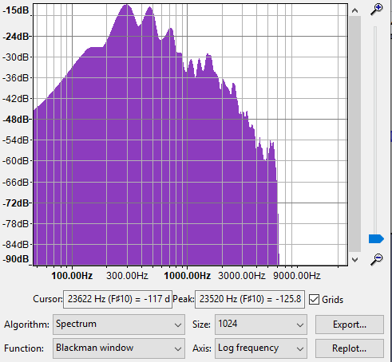
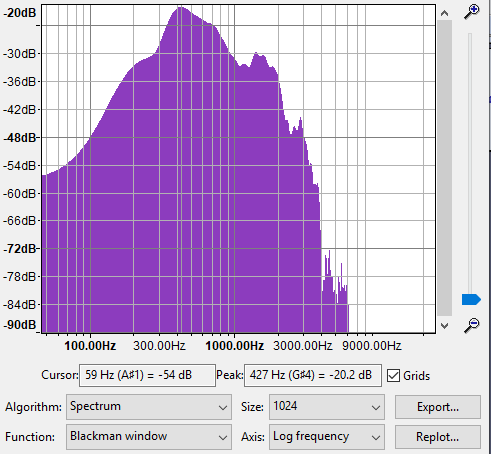
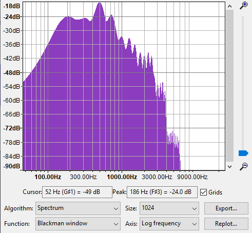

<u>Voice classifier</u>
  

<ul>
<li><b>Voice classifier</b> is <b>Artificial</b> Neural Network based classifier who's goal is to classify different voices or sound against provided labeled training dataset which consist of doctored <b>RAW audio</b> file.</li>
<li>For training all RAW Audio files must be of same size preferably <b>atleast 30 second</b> duration</li>
<li>RAW audio training data must not contain any <b>silence</b></li>
<li>This model is trained and tested in <b>8-bit unsigned PCM</b> RAW audio format.</li>
</ul>

## Audio Format

<ul>
<li> RAW audio format is sampled at <b>44100H</b>z which means amplitude of sound wave is taken 44100 times every second.
<li> Amplitude is divided into <b>256 parts</b> (in 8-bit PCM format) and stored in RAW audio file
<li> 
</ul>
    <i>NOTE: 44100Hz is chosen because if <b>nyquist rate</b> fc > 2fm where fm = 20,000Hz (max human hearable frequency)</i>

## Working

<ul>
<li> Every voice (say human voice) have distinct <b>spectrum</b> of frequency of <b>harmonices (Hz)</b> and <b>loudness (dB)</b>
<li> It is observed that around <b>1024 sample</b> is optimum for distinguishing several voices.
<li> But because of sampling rate 44100Hz sample size should be multiple of 44100 because if we multiply 
    sample rate with time <i>t</i>. we get total sample which is divided to get total training set size which should be integer
     <i><b>(44100t)/n = total_tarining_set</b></i>
<li> Nearest integer is <b>882</b>
</ul>

## Spectrum

### CASE-1

### CASE-2

### CASE-3

<small>https://singhroshan1999.github.io/voice-classifier/</small>